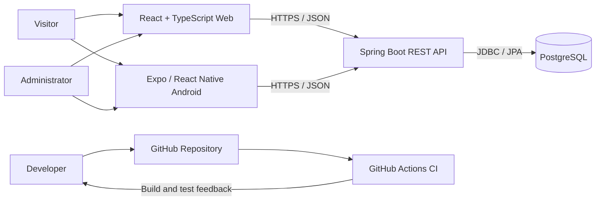
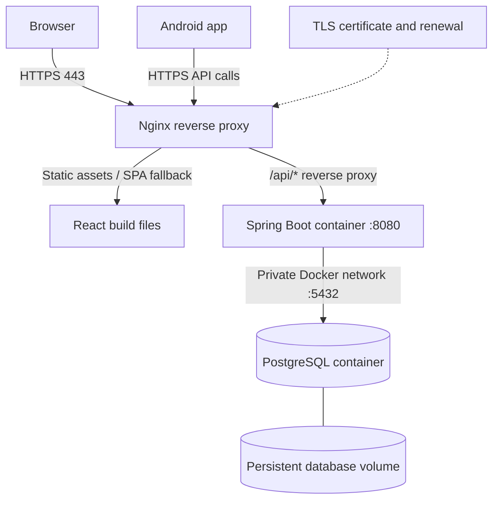
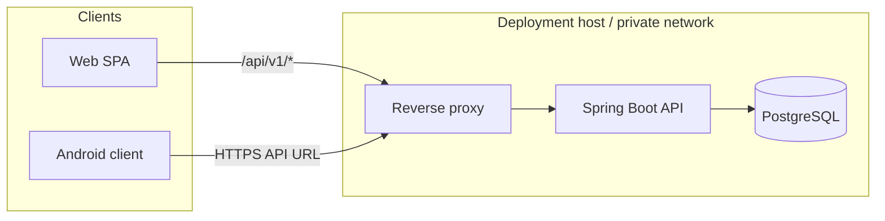
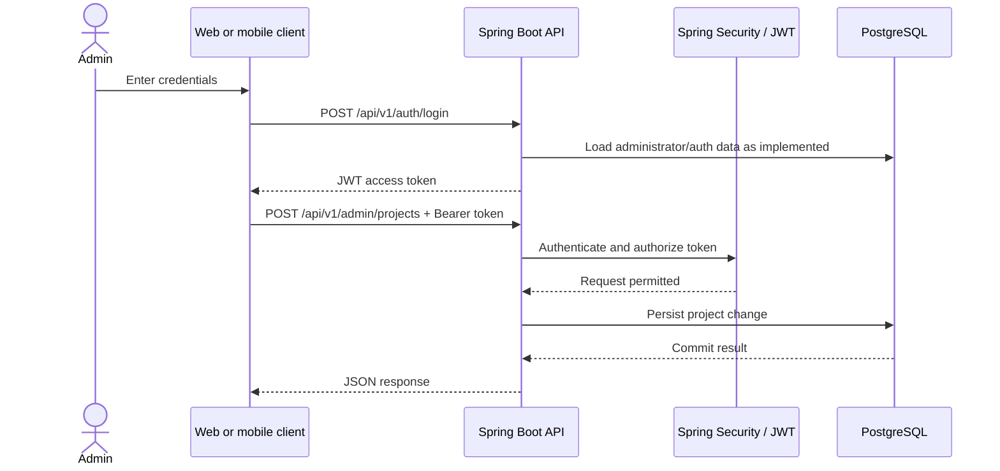
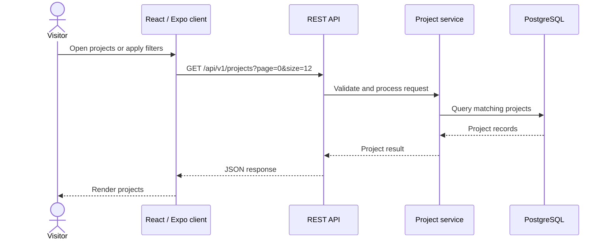
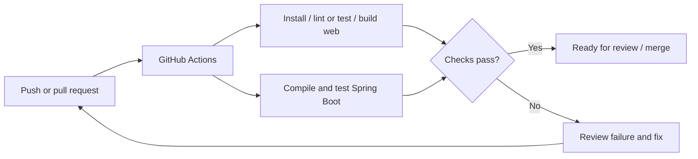

# AxeMax Studio — Architecture Diagrams

These Mermaid diagrams document the current high-level implementation. Planned capabilities are labeled as such.

## 1. System context

## 2. Production deployment (recommended)

The diagram describes the recommended deployment topology, not an already-live deployment. PostgreSQL should have no public port mapping; the API should only be reachable through the reverse proxy/private network.

## 3. Runtime containers

## 4. Admin authentication and protected project changes

The exact authentication lookup and token-validation implementation should be confirmed in backend code; the diagram shows the intended high-level flow.

## 5. Public project read flow

## 6. CI workflow (conceptual)

Check the workflow file for the exact current jobs and triggers. This diagram is a high-level representation of the repository's CI purpose, not a guarantee that every suggested check is configured.
